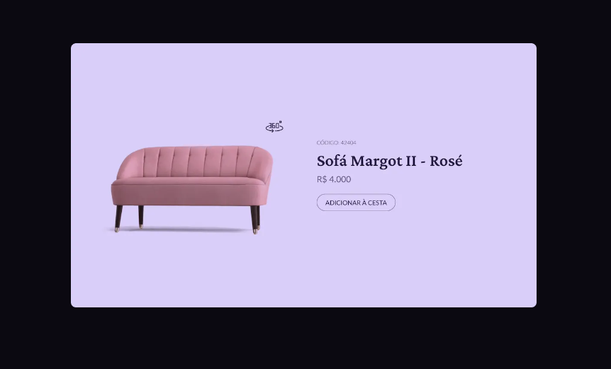
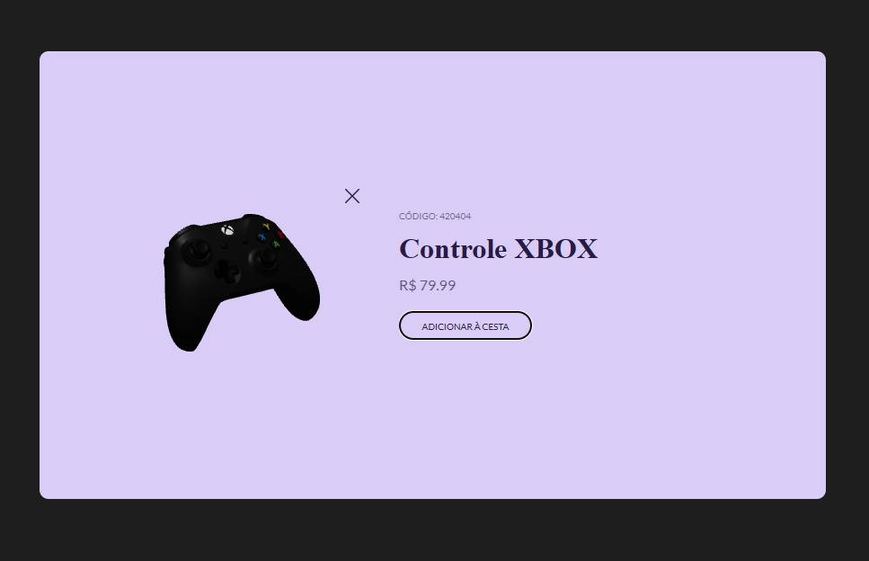
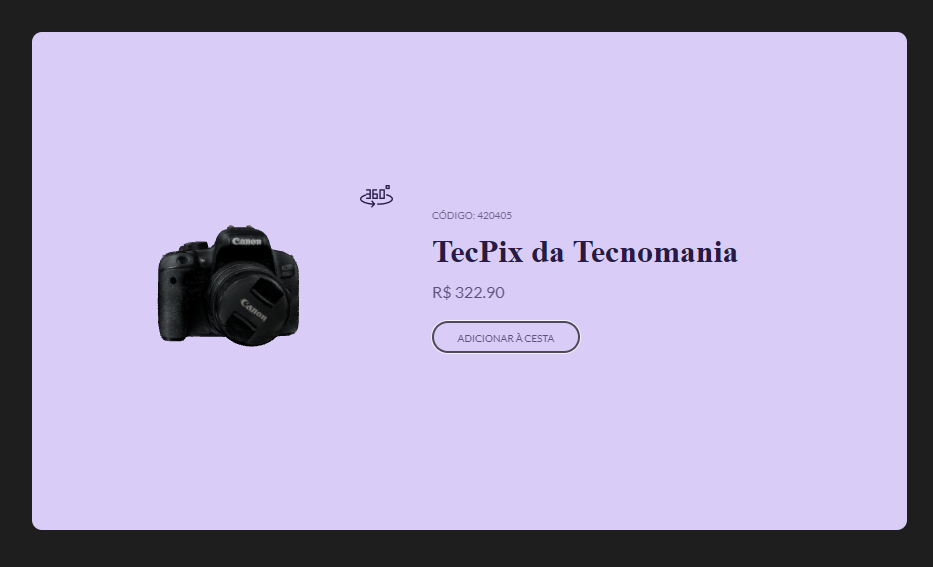

# Card de produtos com exibição 3D
Cartão para exibição de produtos em 3D, contendo código do produto, descrição e valor. Desafio #boraCodar da rocketseat. 

O projeto original consistia na exibição de uma imagem estática, onde ao clicar no botão '360' um gif era startado para representar a visão 3D do objeto, como mostrado a seguir: 



Em minha implementação foi adicionado recursos de modelos 3D onde o usuário pode interagir com o objeto em exibição. Para isso utilizou-se os seguintes pacotes:

- [three](https://threejs.org/docs/)
- react-three/drei
- react-three/fiber
- [pmndrs/gltfjsx](https://docs.pmnd.rs/)
  

Todos os modelos 3D utilizados no projeto foram retirados do site:
[Download Free 3D](https://downloadfree3d.com/).

O objeto inicia com uma rotação automática, e o usuário pode clicar no botão '360' para permitir a interação com o objeto. A troca de objetos exibidos é feita através do botão de `adicionar à cesta` As imagens do projeto podem ser vistas a seguir:




## **Configurações para exibição dos modelos**

Os modelos estão no formato `.glb` e precisaram passar por uma conversão utilizando o `gltfjsx`.

Para converter o arquivo utilizou-se o comando:
```
npx gltfjsx caminhodoarquivo/arquivo.glb --transform -t
```
Ao executar esse código foram gerados 2 arquivos, um `arquivo-transformed.glb` e outro `Arquivo.Jsx` que é a função Js para utilizar dentro do Canva do pacote Three.js.

Com isso foi criado a cena que exibe o modelo convertido, lembrando que cada modelo precisa ser ajustado quando a sua posição no plano 3D e sua visualização de câmera.


